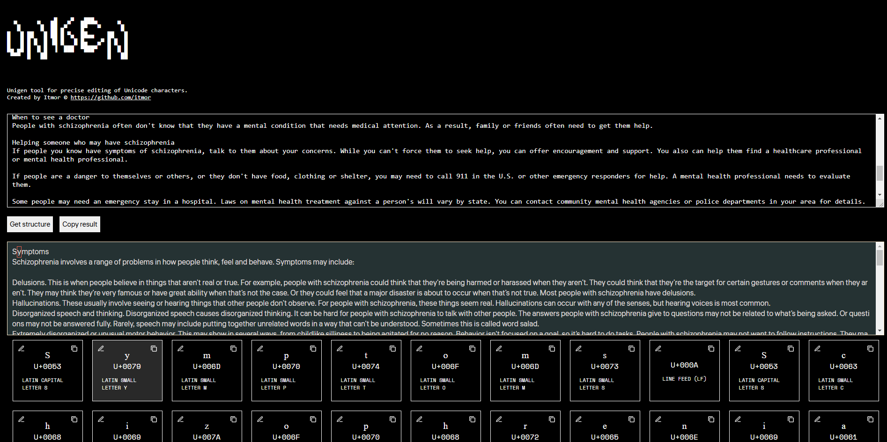
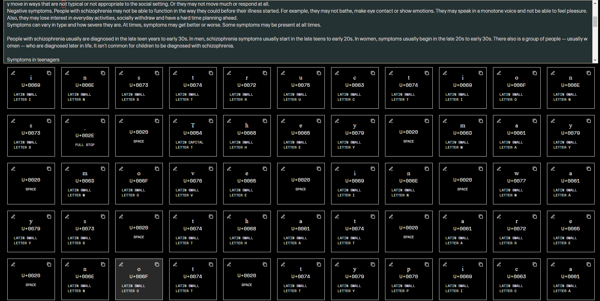

🌍 Use online -> https://itmor.github.io/unigen/

Sticky panel

# Unigen – Advanced Unicode Editor  
*Developed by Itmor*  

**Unigen** is a powerful and user-friendly tool for editing, transforming, and analyzing Unicode text.  
Working with multilingual text, special characters, or encodings? UniGen ensures accuracy and convenience in data processing.  

## Features  
- **Full Unicode support** – edit text in any language and script.  
- **Character analysis** – basic information.  
- **Text transformation** – precisely modify characters in the text.  
- **Convenient character-by-character view** with position tracking.  

**Unigen** is the perfect tool for developers, linguists, and anyone working with complex textual data.  

🚀 **Unlock new possibilities in Unicode editing!**  

---

# Unigen – продвинутый редактор Unicode  
*Разработано Itmor*  

**Unigen** — это мощный и удобный инструмент для редактирования, преобразования и анализа строк в формате Unicode. Работаете с многоязычным текстом, специальными символами или кодировками? UniGen обеспечит точность и удобство в обработке данных.  

## Возможности  
- Полная поддержка Unicode – редактируйте текст на любом языке и в любом скрипте.  
- Анализ символов – базовая информация.  
- Преобразование текста – редактируйте точечно символы в тексте
- Удобный просмотр каждого символа отдельно и показ позиции символа

**Unigen** — идеальный инструмент для разработчиков, лингвистов и всех, кто работает со сложными текстовыми данными.  

🚀 **Откройте новые возможности редактирования Unicode!**  

TAGS
unicode-editor  
unicode-online  
unicode-tools  
unicode-converter  
unicode-text  
unicode-parser  
unicode-generator  
unicode-inspector  
unicode-visualizer  
unicode-lookup  
unicode-table  
unicode-math  
unicode-symbols  
unicode-characters  
unicode-decoder  
unicode-encoder  
unicode-fonts  
unicode-support  
unicode-analysis  
unicode-utility  
utf8-editor  
utf8-decoder  
utf8-encoder  
utf8-tools  
utf16-support  
utf16-editor  
utf16-converter  
utf16-decoder  
utf16-encoder  
text-editor-online  
text-tools  
text-manipulation  
text-processing  
character-map  
character-converter  
character-encoding  
character-tools  
emoji-editor  
emoji-support  
emoji-text  
emoji-converter  
special-characters  
html-entities  
html-special-chars  
ascii-editor  
ascii-tools  
ascii-converter  
ascii-decoder  
ascii-encoder  
encoding-tools  
encoding-converter  
text-encoding  
multilingual-text  
web-text-tools  
online-text-tools  
online-text-editor  
symbol-editor  
text-transform  
text-utilities  
text-formatting  
text-analysis  
text-visualization  
online-font-tools  
unicode-to-ascii  
unicode-to-html  
unicode-normalizer  
unicode-checker  
unicode-viewer  
unicode-string-tools  
hex-to-unicode  
base64-to-unicode  
unicode-character-finder  
online-character-tools  
text-encoding-detector  
text-converter-online  
юникод-редактор  
онлайн-юникод-редактор  
unicode-конвертер  
utf8-конвертер  
utf16-конвертер  
ascii-конвертер  
кодировка-текста  
таблица-юникода  
таблица-символов  
конвертер-эмодзи  
html-спецсимволы  
unicode-parser  
unicode-lookup  
unicode-визуализация  
обработка-текста  
спецсимволы-онлайн  
онлайн-кодировка  
онлайн-конвертер-текста  
редактор-юникода  
анализ-текста  
utf8-декодер  
utf8-энкодер  
utf16-декодер  
utf16-энкодер  
ascii-декодер  
ascii-энкодер  
конвертер-символов  
конвертер-текста  
таблица-кодов-юникод  
шрифты-юникод  
юникод-утилиты  
редактор-символов  
конвертер-emoji  
unicode-текст  
кодировка-html  
конвертер-html  
редактор-html  
юникод-шрифты  
юникод-утилиты  
редактор-кодировки  
онлайн-конвертер-символов  
анализатор-текста  
онлайн-анализатор-кодировки  
онлайн-инструменты-текста  
юникод-инспектор  
юникод-нормализация  
юникод-генератор  
ascii-визуализатор  
кодировка-utf8  
кодировка-utf16  
юникод-транслятор  
юникод-проверка  
онлайн-проверка-юникода  
онлайн-инструменты-символов  
детектор-кодировки  
конвертер-кодировок  
